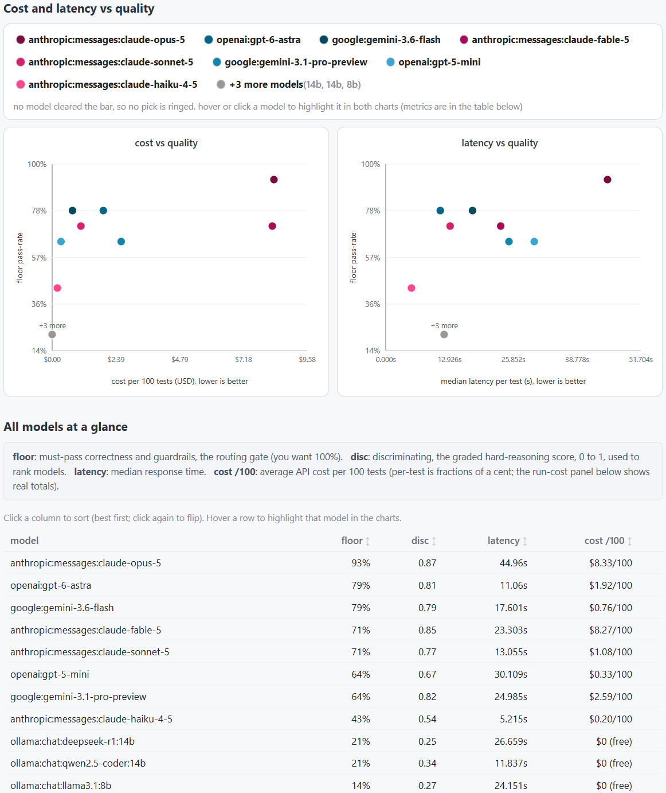

# clawhound

clawhound tells you which model to run for the tasks you rely on, and whether to
switch when a new one ships. It answers from your own work, not vibes and not a
generic leaderboard. Once you've narrowed to a model, you can extend the suite to
compare thinking levels on that model.

It is a thin layer on top of [promptfoo](https://www.promptfoo.dev), the standard
open-source eval runner. promptfoo runs your tests across every provider (OpenAI,
Anthropic, Gemini, and local or any OpenAI-compatible endpoint) and records
pass/fail, graded scores, tokens, and cost. clawhound adds the three things
promptfoo leaves to you:

1. **It writes the tests.** A skill mines your repo's own accumulated knowledge
   (CLAUDE.md, gotcha and memory notes, domain rules, past incidents, existing
   tests) and drafts a promptfoo suite from it, the tests you would never sit down
   and hand-write.
2. **Your preference tests.** The tacit expectations no doc holds and no benchmark
   could have, because they are yours: "timestamps always in US Eastern," "the
   morning brief leads with my teams." These are the personalization.
3. **It decides.** promptfoo shows the numbers; `recommend.py` reads them and tells
   you which model to run, whether it clears your bar, and what it costs, with a
   cost-vs-quality chart a non-technical owner gets at a glance.

## What you get



The decision report: both frontier charts (cost and latency vs floor pass-rate),
models colored by vendor with the free / local tier collapsed into a gray group,
and a sortable all-models table (floor, disc, latency, cost). Hover any model to
highlight it across both charts and the table.

## Two layers of tests

- **Floor** (deterministic, must pass): correctness and guardrails, mined from
  your rules. You want these at 100%; the signal is any drop.
- **Discriminating** (graded): your hardest tasks, which spread models apart so
  they can be ranked. A suite everyone aces ranks nothing.

See `docs/eval-design-guide.md` for the rule-to-assertion mapping.

## Quickstart

```bash
# 1. Install the runner
npm install -g promptfoo        # or use: npx promptfoo@latest

# 2. Build a suite: run the suite-generation skill against your repo, or start
#    from templates/promptfooconfig.yaml and add your preference tests.

# 2b. Review the draft before spending a token, one scannable line per test:
python postprocess/digest.py path/to/promptfooconfig.yaml

# 3. Put your keys in a .env next to the config (gitignored):
#    ANTHROPIC_API_KEY=...   OPENAI_API_KEY=...   GEMINI_API_KEY=...

# 4. Run every model against every test
promptfoo eval --output results.json

# 5. Decide: which model to run, and the chart
python postprocess/recommend.py results.json --incumbent anthropic:messages:claude-opus-4-8 --out report.html
```

## Getting an API key

Each is billed per token, separate from any chat subscription.

- Anthropic: console.anthropic.com
- OpenAI: platform.openai.com
- Google Gemini: Google AI Studio (aistudio.google.com)

## Local and other providers

Point a promptfoo provider at any OpenAI-compatible endpoint with `apiBaseUrl`:
Ollama (`http://localhost:11434/v1`), vLLM, LM Studio, or hosted APIs like
Kimi/Moonshot, Together, and OpenRouter. See the commented block in
`templates/promptfooconfig.yaml`.

clawhound tests text in, text out, and scores one request against one response.
Deliberately out of scope: multi-turn autonomy and corrections-per-task (a model
that wins each item but needs five corrections per task is worse in practice, and
this does not measure that), and loops with a non-text modality in them
(render-look-and-fix visual self-correction, image-generation endpoints like
ComfyUI). Reported cost is cold per-call cost, not a production bill: independent
single-shot tests carry no prompt cache, so a heavily-cached production harness
pays far less.

## Layout

```
postprocess/
  digest.py                review view of a suite before you run: terminal one-line-per-test, or --html for a progressive-disclosure page (plain line per test, prompt + grading on expand)
  recommend.py             reads promptfoo results, recommends a model, writes the chart
skills/
  eval-discovery/          scope + pain + stakes + your preference tests (human)
  suite-generation/        mine the repo -> draft the promptfoo suite (agent)
docs/eval-design-guide.md  rule -> promptfoo assertion; the two layers
templates/
  promptfooconfig.yaml     starter config with floor, discriminating, and preference tests
  scoping-doc.md           the client scoping / proposal artifact
```

Open source under [clawdoglabs](https://github.com/clawdoglabs).
